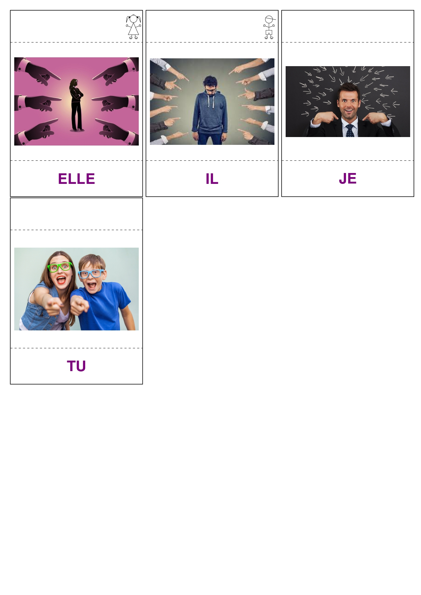
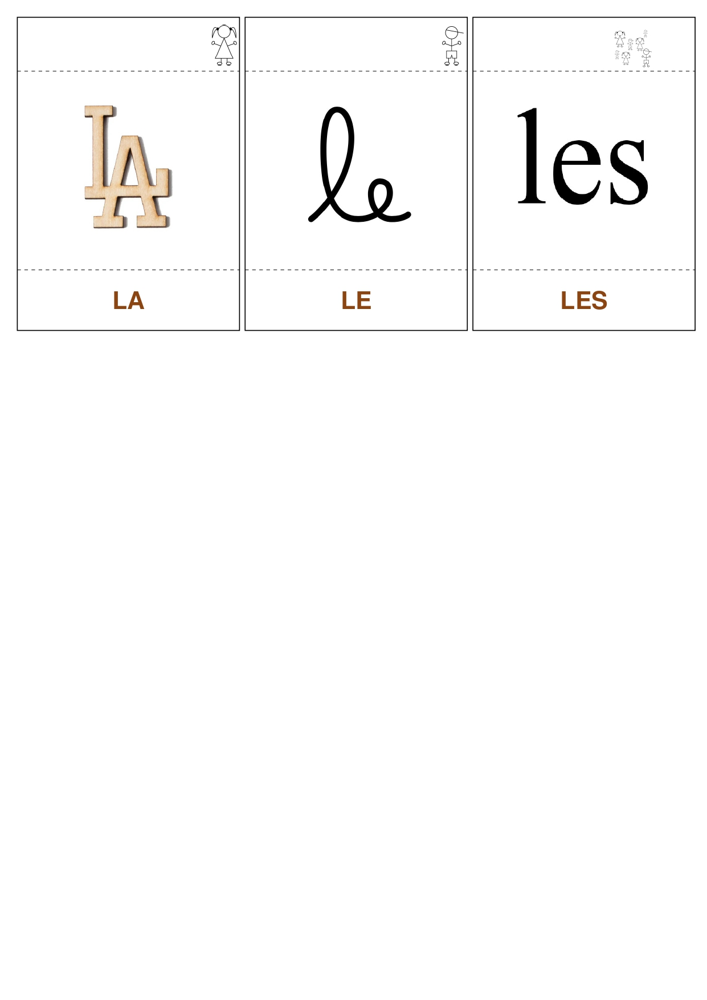
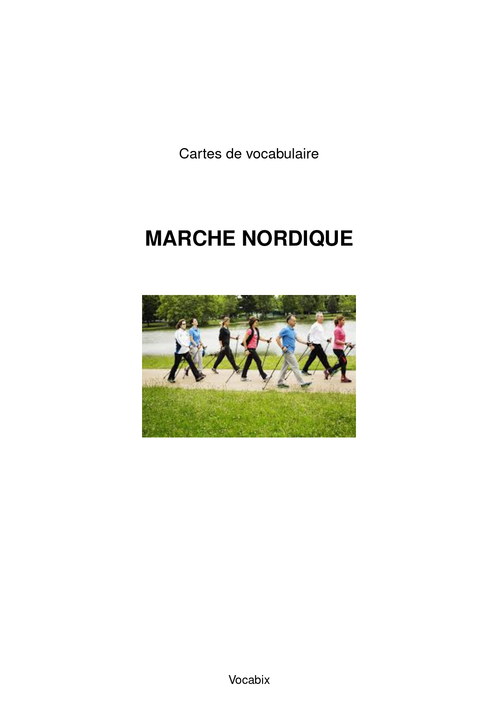
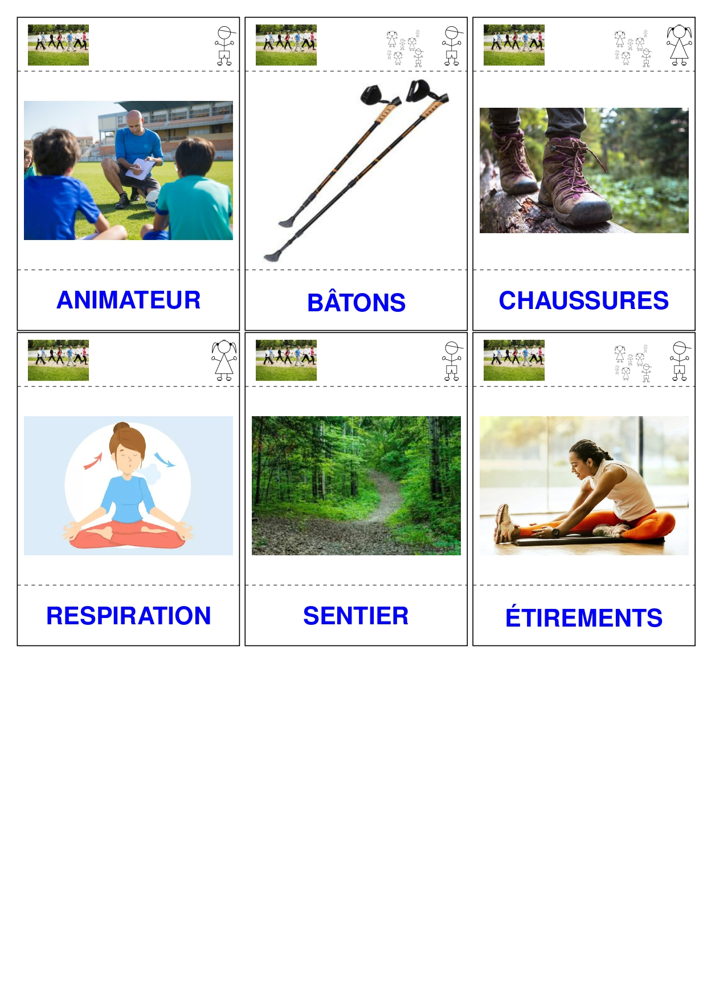
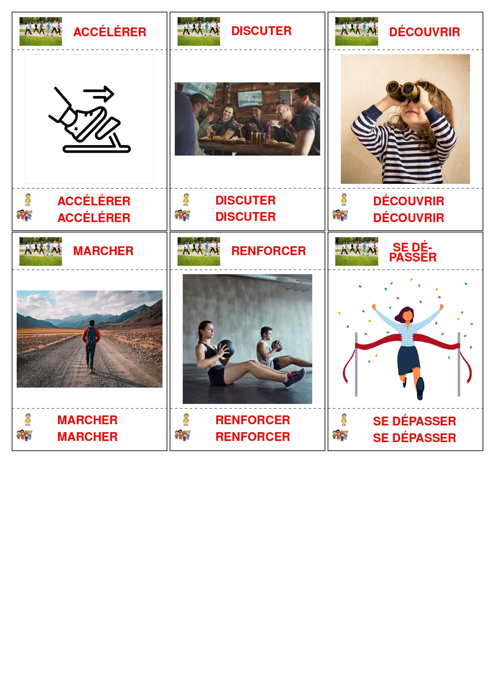
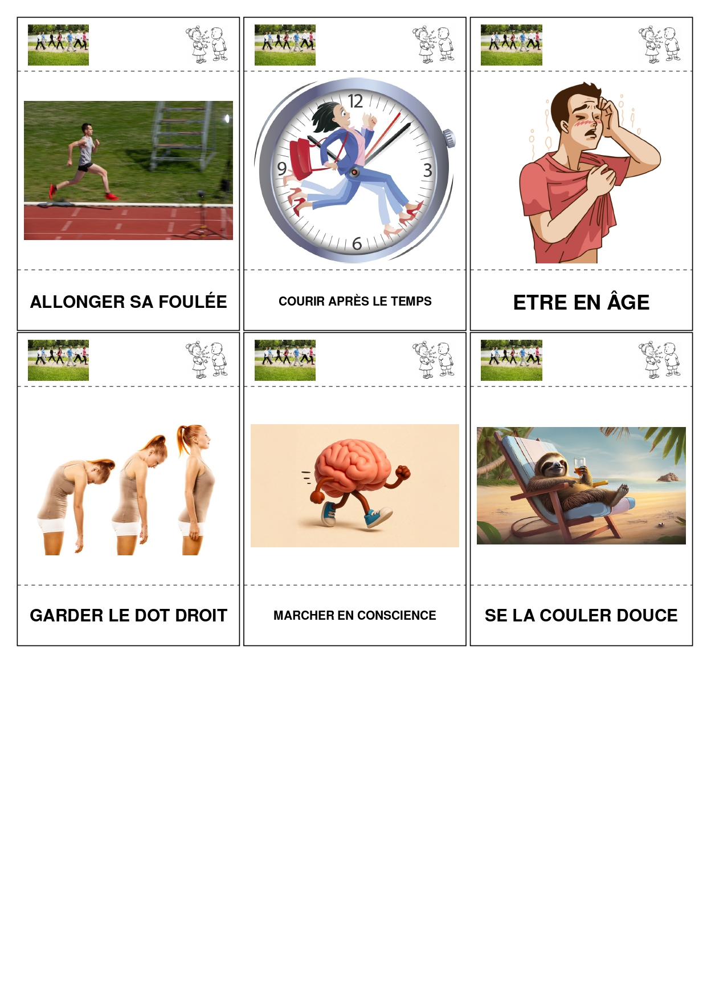

# Vocabix

Vocabix permet de générer automatiquement des fiches et des cartes PDF à partir de dossiers d'images.
L'objectif est simple : vous déposez vos images au bon endroit, puis vous lancez `Vocabix` en double-cliquant.

## 1) Télécharger Vocabix

Télécharger Vocabix pour [Linux](https://github.com/ArthurHoa/vocabix/archive/refs/heads/linux.zip), [Windows] ou [Mac].

## 2) Fonctionnement global (très simple)

1. Double-cliquez sur l'exécutable **Vocabix**.
2. Vocabix lit les images dans les dossiers.
3. Vocabix génère les PDF automatiquement.
4. Si le dossier `Thèmes/NOUVEAU` n'existe pas, il est créé.

Ensuite, vous pouvez ajouter vos images dans les dossiers ci-dessous, puis refaire un double-clic sur **Vocabix** pour régénérer les PDF.

## 3) Un Exemple de projet 

```text
Vocabix/
├── Élèves/
│   ├── images/
│   │   ├── Arthur.jpg
│   │   ├── Heïdi.jpg
│   │   ├── Marc.jpg
│   │   ├── Suzie.jpg
│   │   └── Virginie.jpg
│   └── Élèves.pdf
├── Outils/
│   ├── gris/
│   ├── jaune/
│   ├── marron/
│   │   ├── la_f.webp
│   │   ├── le_m.jpg
│   │   └── les_p.jpg
│   ├── orange/
│   ├── violet/
│   │   ├── elle_f.jpg
│   │   ├── il_m.jpeg
│   │   ├── je.jpg
│   │   └── tu.jpg
│   └── Outils.pdf
└── Thèmes/
    ├── Marche Nordique/
    │   ├── Adjectifs/
  │   │   ├── collectif.png
  │   │   ├── dynamique.jpg
  │   │   ├── énergique.png
  │   │   ├── naturelle.webp
  │   │   ├── rapide.jpg
  │   │   ├── régulière.jpg
  │   │   └── sportive.jpg
    │   ├── Expressions/
  │   │   ├── Allonger sa foulée.jpg
  │   │   ├── courir après le temps.jpeg
  │   │   ├── etre en âge.jpg
  │   │   ├── garder le dot droit.jpg
  │   │   ├── marcher en conscience.webp
  │   │   └── se la couler douce.jpg
    │   ├── Noms/
  │   │   ├── animateur.jpg
  │   │   ├── bâtons.jpg
  │   │   ├── chaussures.jpg
  │   │   ├── étirements.jpg
  │   │   ├── respiration.webp
  │   │   └── sentier.jpeg
    │   ├── Verbes/
  │   │   ├── accélérer.jpg
  │   │   ├── découvrir.jpg
  │   │   ├── discuter.jpg
  │   │   ├── marcher.jpg
  │   │   ├── renforcer.jpg
  │   │   └── se dépasser.jpg
    │   ├── logo/
  │   │   └── logo.jpeg
    │   └── Marche Nordique.pdf
    └── NOUVEAU/
        ├── Adjectifs/
        ├── Expressions/
        ├── Noms/
        ├── Verbes/
        └── logo/
```

Comme vous le voyez, il y a 3 dossiers : `Élèves`, `Outils` et `Thèmes`.
En double cliquant sur Vocabix, trois fichiers `.pdf` sont générés. Dans `Élèves`, le fichier `Élèves.pdf` suivant est généré :

<p>
  
</p>

Dans `Outils`, le fichier `Outils.pdf` suivant est généré :

<p>
  
  
</p>

Enfin, dans `Thèmes/Marche Nordique`, le fichier `Marche Nordique.pdf` suivant est généré :

<p>
  
  
  
  
</p>

## 4) Détail par dossier

### Élèves
- Déposez vos images dans `Élèves/images`.
- Au double-clic sur **Vocabix**, le PDF est généré : `Élèves/Élèves.pdf`.

En clair : vous mettez les images dans `images`, vous relancez **Vocabix**, et vous récupérez directement le PDF des élèves.

### Outils
- Déposez vos images de mots outils dans les sous-dossiers couleur :
  - `Outils/gris`
  - `Outils/jaune`
  - `Outils/marron`
  - `Outils/orange`
  - `Outils/violet`
- Au double-clic sur **Vocabix**, les cartes sont générées et regroupées dans : `Outils/Outils.pdf`.

### Thèmes > Marche Nordique
Dans `Thèmes/Marche Nordique`, vous avez :
- `Adjectifs`
- `Expressions`
- `Noms`
- `Verbes`
- `logo`

Quand vous remplissez ces dossiers avec vos images puis que vous double-cliquez sur **Vocabix**, le PDF est généré ici :
- `Thèmes/Marche Nordique/Marche Nordique.pdf`

## 5) Dossier NOUVEAU

Le dossier `Thèmes/NOUVEAU` sert de modèle pour créer un nouveau thème avec la bonne structure :
- `Adjectifs`
- `Expressions`
- `Noms`
- `Verbes`
- `logo`

Il est prêt à être rempli avec vos images.

## 6) Résumé en une phrase

- Je range mes images dans les bons dossiers.
- Je double-clique sur **Vocabix**.
- Je récupère mes PDF générés automatiquement.
